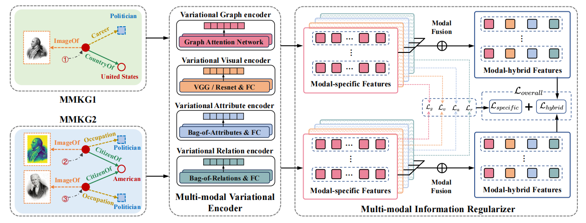

# IBMEA

The code of paper _**IBMEA: Exploring Variational Information Bottleneck for Multi-modal Entity Alignment**_ [[arxiv](https://arxiv.org/abs/2407.19302)] [[ACM MM](https://dl.acm.org/doi/10.1145/3664647.3680954)] in Proceedings of ACM MM 2024.


<div align="center">
    
</div>


## Env

Run the following command to create the required conda environment:

```
conda env create -f environment.yml -n IBMEA
```

## Datasets

### Cross-KG datasets

The original cross-KG datasets (FB15K-DB15K/YAGO15K) comes from [MMKB](https://github.com/mniepert/mmkb), in which the image embeddings are extracted from the pre-trained VGG16. We use the image embeddings provided by [MMKB](https://github.com/mniepert/mmkb#visual-data-for-fb15k-yago15k-and-dbpedia15k). Place `mmkb-datasets` directory  in the `data` directory.

### Bilingual datasets

The multi-modal version of DBP15K dataset comes from the [EVA](https://github.com/cambridgeltl/eva) repository, and the folder `pkls` of DBP15K image features should be downloaded according to the guidance of EVA repository, and the downloaded folder `pkls` is placed in the `data` directory of this repository.

## How to run script

```
run_mmkb_main.sh
run_dbp_main.sh
```

## Citation

If you use this model or code, please cite it as follows:

```
@inproceedings{IBMEA,
  author       = {Taoyu Su and
                  Jiawei Sheng and
                  Shicheng Wang and
                  Xinghua Zhang and
                  Hongbo Xu and
                  Tingwen Liu},
  editor       = {Jianfei Cai and
                  Mohan S. Kankanhalli and
                  Balakrishnan Prabhakaran and
                  Susanne Boll and
                  Ramanathan Subramanian and
                  Liang Zheng and
                  Vivek K. Singh and
                  Pablo C{\'{e}}sar and
                  Lexing Xie and
                  Dong Xu},
  title        = {{IBMEA:} Exploring Variational Information Bottleneck for Multi-modal
                  Entity Alignment},
  booktitle    = {Proceedings of the 32nd {ACM} International Conference on Multimedia,
                  {MM} 2024, Melbourne, VIC, Australia, 28 October 2024 - 1 November
                  2024},
  pages        = {4436--4445},
  publisher    = {{ACM}},
  year         = {2024}
}
```

#### Remarks
- Welcome to give me a star ⭐, let me know how many people want to know about this work 🤩.
- It is said that people who click on stars ⭐ will have better acceptance rates for their papers 😃. 
- **路过点star,下次中A啊！！！！**


